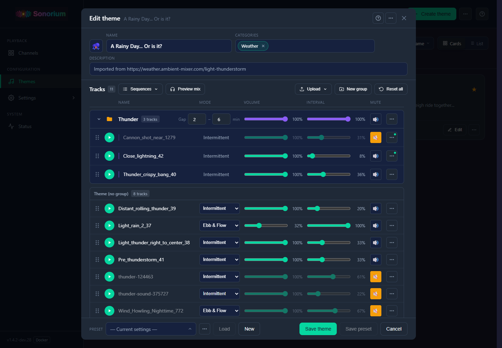
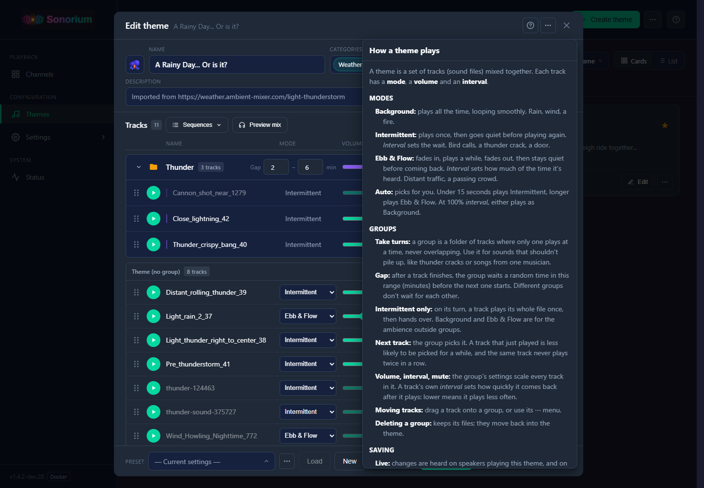
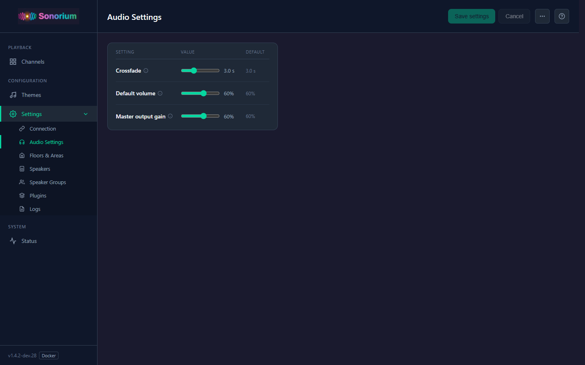
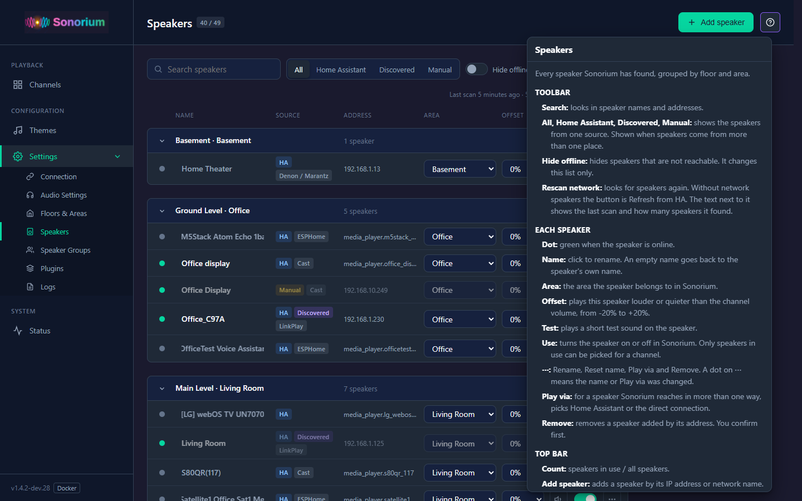
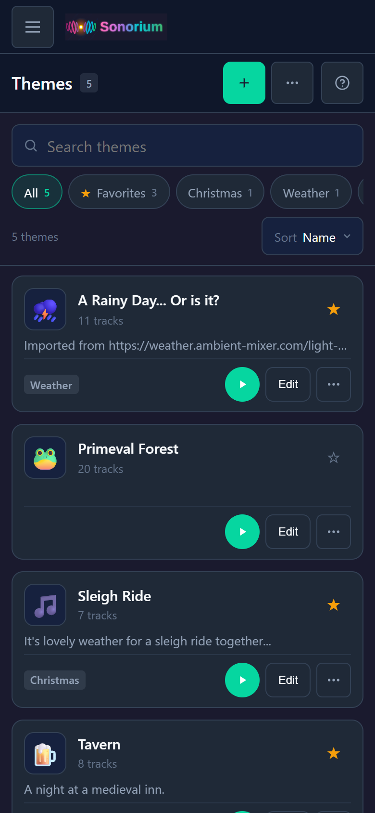
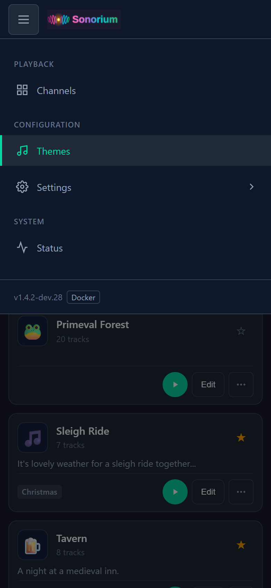

# Sonorium


[Announcements](#announcements) · [About](#about) · [Features](#features) · [Installation](#installation) · [What's new](#whats-new) · [API Reference](#api-reference) · [Acknowledgements](#acknowledgements) · [License](#license) · [Contributing](#contributing)

## Announcements

> ## ⭐ Major Release: 1.5.0, Themes 2.0
>
> This is a major update. Themes can now hold **groups**, channels playing the same theme can each use their **own preset**, the **Theme Editor**, the **Themes** page and every **Settings** page are rebuilt, and the playback modes have **new names**.
>
> Before, two channels playing the same theme shared one preset: change it on one, and it changed on both. Now each channel is isolated.
>
> Your themes are converted automatically the first time this version starts. Each theme's old settings file is kept next to it as `metadata.json.pre-presets.bak`.

10/6/2026 - This is still alive. Just getting back into things.

## About

**Multi-Zone Ambient Soundscape Mixer**

Sonorium lets you create immersive ambient audio environments. Stream richly layered soundscapes—from distant thunder and rainfall to forest ambiance and ocean waves—to speakers throughout your home or directly through your computer.

### Why Ambient Sound?

Ambient soundscapes aren't just background noise—they're a powerful tool for mental wellness and productivity:

- **ADHD & Focus**: Background noise can improve concentration by providing consistent auditory input
- **Misophonia**: Ambient masking helps cover trigger sounds
- **Anxiety & Stress**: Nature sounds activate the parasympathetic nervous system
- **Sleep**: Consistent ambient sound masks disruptive noises
- **Work & Study**: Moderate ambient noise can boost creative thinking

### Screenshots

#### Channels
Each channel plays its own theme on its own speakers.


#### Edit Channel
Search themes, then pick speakers by floor, room or one at a time.


#### Themes
Search, filter by category, and switch between cards and a list.


#### Edit Theme
Tracks in one table, with groups, presets and a live preview.



#### Theme Editor help
The **?** button explains modes, groups and saving.



#### Settings → Connection
Home Assistant, MQTT and Streaming, each with its status (Docker).


#### Settings → Audio Settings
Sound settings in one card, with Save and Cancel in the top bar.



#### Settings → Speakers
Speakers grouped by floor and area: rename, area, offset, test sound, on or off.


#### Add Speaker
Add a speaker the network scan didn't find, by its address (Docker).


#### Settings → Logs
Recent messages with filters, search, copy and download.


#### Help on every page
The **?** in the top bar explains the page you're on.



#### On a phone
The menu opens from the top bar.

 

## Features

#### Multi-Zone Audio
- **Multiple Channels**: Run up to 10 independent audio channels simultaneously (configurable)
- **Per-Channel Themes**: Each channel plays its own theme
- **Flexible Speaker Selection**: Target individual speakers, entire rooms, floors, or custom speaker groups
- **Live Speaker Management**: Add or remove speakers from active channels without interrupting playback

#### Speakers
- **Speaker Settings**: Rename speakers, set their room, and add a volume offset for speakers that play louder or quieter than the rest
- **Test Sound**: Play a short, quiet chime to check a speaker
- **Choose What Sonorium Uses**: Speakers switched off in Settings never appear in channels
- **Network Speakers (Docker)**: Finds Google Cast, Sonos, DLNA, AirPlay, LinkPlay and HEOS speakers on your network, or add one by address
- **One Speaker, Two Paths (Docker)**: A speaker found both in Home Assistant and on the network is shown once, and you choose which way it plays

#### Theme System
- **Theme-Based Organization**: Audio files organized into theme folders (Thunder, Forest, Ocean, etc.)
- **Automatic Mixing**: All recordings in a theme blend together seamlessly
- **Theme Favorites**: Star your most-used themes for quick access
- **Custom Categories**: Organize themes into categories like "Weather", "Nature", "Urban"
- **Theme Icons**: Visual icons for easy theme identification
- **Bundled Themes**: Includes Sleigh Ride, Tavern, and "A Rainy Day... Or is it?" out of the box

#### Track Mixer
Fine-tune how each audio file plays within a theme:

- **Interval** - Set how often each track is heard in the mix (0-100%)
- **Per-Track Volume** - Adjust amplitude independent of interval
- **Playback Modes**:
  - **Auto** - Picks for you: sounds under 15 seconds play Intermittent and longer ones play Ebb & Flow; at 100% "interval", either plays as Background
  - **Background** - Plays all the time, looping with a smooth crossfade (rain, wind, a crackling fire)
  - **Intermittent** - Plays once, then goes quiet for a while before playing again; "interval" sets the wait (bird calls, thunder claps, a door creaking)
  - **Ebb & Flow** - Fades in, plays for a while, fades out, then stays quiet before coming back; "interval" sets how much of the time it's heard (distant traffic, a passing crowd)
- **Groups** - A group is a folder inside the theme whose tracks take turns: only one plays at a time, never overlapping, with a random gap (in minutes) between them. Every track in an Intermittent group (the default) plays Intermittent: its whole file once, start to finish, with no fade. The group picks the next track by weight: each time a track plays it gets heavier and less likely to be picked, the weight wears off as other tracks play, and a track's interval sets how fast. The same track never plays twice in a row. Background and Ebb & Flow are for the ambience outside groups. Deleting a group keeps its files.
- **Merry-go-round groups** - A group set to Merry-go-round makes a continuous bed instead: one file plays, then crossfades into another picked at random, never the same one twice in a row. Each group sets its own crossfade (seconds). A single file crossfades into itself.

#### Presets
- **Save/Load Presets** - Store track settings as named presets
- **Quick Switching** - Select presets directly on channel cards
- **Import/Export** - Share presets with the community
- **Follows the Theme** - Changing a channel's theme switches to that theme's default preset

#### Home Assistant Dashboard Integration (Addon)
- **MQTT Entities** - Full dashboard control via MQTT (session select, theme/preset dropdowns, play/stop, volume)
- **Human-Readable Names** - Theme and preset dropdowns show names instead of UUIDs
- **Status Sensors** - See playback status and assigned speakers from your dashboard
- **Automation Support** - Use HA automations to trigger soundscapes (morning alarms, schedules, etc.)

#### Modern Web Interface
- **Responsive Design**: Works on desktop and mobile; on a phone the menu opens from a top bar that's always there
- **Help on Every Page**: The **?** in the top bar explains the page you're on
- **Dark Theme**: Easy on the eyes
- **Real-Time Status**: See what's playing across all channels
- **Drag & Drop**: Upload audio files directly through the UI
- **Logs Page**: Recent messages with filters, search and download, even when startup fails
- **Speaker Screens**: Google Cast displays show the Sonorium logo while playing

### Supported Formats

Audio files: `.mp3`, `.wav`, `.flac`, `.ogg`

Single-file themes loop seamlessly using crossfade blending—no jarring restarts!

### Supported Speakers

#### Standalone App
- Local audio output (default speakers)
- DLNA/UPnP network speakers
- Sonos speakers (via SoCo library)
- Arylic/Linkplay speakers (via HTTP API)
- **HEOS speakers (Denon/Marantz)** - Beta, via CLI protocol
- *Coming soon: AirPlay (other devices), Chromecast*

#### Docker
- Google Cast (Chromecast, Nest Hub, Google Home)
- Sonos
- DLNA/UPnP speakers
- AirPlay
- Arylic/LinkPlay
- HEOS (Denon/Marantz)
- Plus every Home Assistant speaker, if you connect Home Assistant

#### Home Assistant Addon
- Any media_player entity in Home Assistant
- **Google Cast** (Chromecast, Nest Hub, Google Home), played through Home Assistant's Cast integration
- **Sonos** - Native streaming via SoCo library
- Organized by floors, areas, and custom groups

## Installation

### Ways to Use Sonorium

#### Standalone Windows App

Download and run without any dependencies. Perfect for desktop ambient sound.

**[Download Latest Release](https://github.com/synssins/sonorium/releases)** | **[Installation Guide](https://github.com/synssins/sonorium/wiki/Standalone-App)**

- Single portable executable—no installation required
- Local audio playback through your default speakers
- Stream to DLNA network speakers
- Automatic updates built-in

#### Home Assistant Addon

Integrate with your smart home for whole-house audio.

[](https://my.home-assistant.io/redirect/supervisor_add_addon_repository/?repository_url=https%3A%2F%2Fgithub.com%2Fsynssins%2Fsonorium)

- One-click install from addon store
- Use any Home Assistant media_player
- Organize speakers by room, floor, or area
- Control from the HA dashboard

#### Docker

Runs on any Docker host, with or without Home Assistant.

- Finds Google Cast, Sonos, DLNA, AirPlay, LinkPlay and HEOS speakers on your network
- Home Assistant and MQTT are optional, set up from the web UI
- Image: `ghcr.io/synssins/sonorium:latest`

### Quick Start

#### Standalone App

1. **Download** `Sonorium.exe` from the [Releases page](https://github.com/synssins/sonorium/releases)
2. **Run** the executable (click "More info" → "Run anyway" if Windows SmartScreen appears)
3. **Create** a session, select a theme and speakers
4. **Play** and enjoy your ambient soundscape

#### Home Assistant Addon

Sonorium needs the **Mosquitto broker** add-on (Settings → Add-ons → Add-on Store), started with **Start on boot** on.

1. **Install** the addon using the button above
2. **Open Sonorium** from your Home Assistant sidebar
3. **Add Themes**: Create themes and upload audio via the web interface
4. **Create a Channel**: Select a theme and speakers
5. **Play**: Hit the play button

#### Docker

```yaml
services:
  sonorium:
    image: ghcr.io/synssins/sonorium:latest
    container_name: sonorium
    network_mode: host        # needed to find speakers on your network
    environment:
      - PUID=1000             # optional: owner of the files Sonorium writes
      - PGID=1000
      - TZ=Etc/UTC            # your time zone, for log times
    volumes:
      - ./sonorium/config:/config          # settings and channels
      - ./sonorium/media:/media/sonorium   # themes and audio
    restart: unless-stopped
```

1. **Start** it with `docker compose up -d`
2. **Open** `http://<docker-host>:8008`
3. **Optional:** connect Home Assistant and MQTT under **Settings → Connection**
4. **Create a Channel** and press play

### Documentation

**Which version am I on?** The version and the install type (Home Assistant app or Docker) are at the bottom left of the menu. On a phone, open the menu from the top bar to see them. Include both when you report a problem.

Full documentation is available in the **[Wiki](https://github.com/synssins/sonorium/wiki)**:

- [Getting Started](https://github.com/synssins/sonorium/wiki/Getting-Started) - Home Assistant installation
- [Standalone App](https://github.com/synssins/sonorium/wiki/Standalone-App) - Windows app guide with architecture details
- [Themes](https://github.com/synssins/sonorium/wiki/Themes) - Creating and organizing themes
- [Track Settings](https://github.com/synssins/sonorium/wiki/Track-Settings) - Playback modes explained
- [Presets](https://github.com/synssins/sonorium/wiki/Presets) - Saving track configurations
- [Speakers](https://github.com/synssins/sonorium/wiki/Speakers) - Speaker setup and management
- [API Reference](https://github.com/synssins/sonorium/wiki/API-Reference) - REST API for automation
- [Troubleshooting](https://github.com/synssins/sonorium/wiki/Troubleshooting) - Common issues

## What's new

#### Next release

**Themes and playback**
- **Merry-go-round groups.** A group can now play as a continuous bed: one file plays, then crossfades into another picked at random, never the same one twice in a row. Pick the mode and the crossfade length in the group's row in the Theme Editor. A single file crossfades into itself.

#### 1.5.0

**Themes and playback**
- **Groups.** A folder inside a theme is a group: its tracks take turns, one at a time, never overlapping, with a random gap between them. This replaces the need to check "Exclusive" on every track that needed to play independently of other exclusive tracks in a theme.
- **The group picks the next track by weight.** Each time a track plays it gets heavier and less likely to be picked; the weight wears off as other tracks play. A track's Interval sets how fast. The same track never plays twice in a row.
- **Grouped tracks just play.** On its turn a track plays its whole file once, start to finish, with no fade in or out. A thunder crack keeps its crack, a song its first notes.
- **A preset per channel.** Two channels can play the same theme with different presets. Before, they shared one: changing the preset on one changed it on both.
- **New files join right away.** A file added to a theme that is playing joins the mix at once, with its saved settings. A removed file leaves the mix. Nothing restarts.
- **Theme files stay tidy.** `metadata.json` and the presets follow the theme's files: a new file gets an entry with the default settings, and entries for removed files and group folders are deleted. The first time 1.5.0 starts it also clears out old leftover entries.
- **New mode names.** Continuous is now **Background**, Sparse is **Intermittent**, Presence is **Ebb & Flow**. The "How often" slider is now **Interval**. Your saved settings keep working.
- **Steadier sound.** The mix keeps an even level as tracks come and go, without clipping. Themes with many occasional sounds no longer play quietly.

**Theme Editor**
- **Redesigned.** Name, categories and description at the top; every track in one aligned table with its mode, volume, interval and mute; groups as sections you can collapse; upload, drag tracks between groups, and presets at the bottom.
- **Live changes.** What you change is heard on speakers playing the theme while you edit. **Cancel** reverts unsaved changes; **Save Theme** keeps them and closes.
- **Preview mix** plays the whole theme on the device you're editing from, without touching the speakers.
- **Help.** The **?** button explains modes, groups and saving.

**Themes page**
- Search, category chips, sort, and cards or a list. Each theme appears once, with its categories, a preview button and a badge for the channel playing it.
- **Create theme** asks for a name and opens the new theme in the editor.

**Every page**
- **New look.** Every page has the same top bar, lined up with the logo. Page buttons, including **Save** and **Cancel**, sit on the right of the top bar instead of at the bottom.
- **Help on every page.** The **?** at the far right of the top bar explains that page in plain words.
- **Settings pages** are compact and left-aligned:
  - **Connection** shows Home Assistant, MQTT and Streaming as cards, each with a status.
  - **Audio Settings** is a single card.
  - **Speakers** groups speakers by floor and area.
  - **Speaker Groups**, **Plugins**, **Advanced** and **Status** use the same layout.
- **"Add" everywhere.** Buttons that make something new read "Add": **Add speaker**, **Add group**, **Add floor**, **Add area**. Empty pages no longer repeat the top-bar button.
- **Confirmations** use a small prompt on the page instead of a browser pop-up.
- **Phones.** A top bar with the menu button is always there. The menu opens downward, closes when you pick a page or tap the button again, and Settings expands in place. Cards fill the screen width and nothing scrolls sideways.

**Docker and standalone**
- **Remove a connection without a restart.** The trash button on **Settings → Connection** removes Home Assistant, and its floors, areas and speakers disappear from every list at once. Removing MQTT also removes Sonorium's entities from Home Assistant.
- **Floors & Areas** can be added and edited outside the Home Assistant app.
- **Settings show what applies to your install.** One install check decides which settings each install shows.

**Fixes**
- A memory leak while playing.
- Tracks in a group could overlap after a stall.
- Presets changed settings they hadn't saved.
- The Settings menu cut off its last items.
- Adding floors and areas failed with an error.
- Deleting a speaker group in use said "session(s)" instead of "channel(s)".
- The Theme Editor opened with a preset already selected, which made it easy to overwrite.

**Known issue**
- In the Home Assistant app, **Crossfade** and **Master output gain** on **Settings → Audio Settings** are saved but don't change the sound yet.

##### How a theme plays

These are the same words as the **?** help in the Theme Editor.

A theme is a set of tracks (sound files) mixed together. Each track has a **mode**, a **volume** and an **interval**.


**Modes**

- **Background:** plays all the time, looping smoothly. Rain, wind, a fire.
- **Intermittent:** plays once, then goes quiet before playing again. *Interval* sets the wait. In a group, the group decides when it plays. Bird calls, a thunder crack, a door.
- **Ebb & Flow:** fades in, plays a while, fades out, then stays quiet before coming back. *Interval* sets how much of the time it's heard. Distant traffic, a passing crowd.
- **Auto:** picks for you. Under 15 seconds plays Intermittent, longer plays Ebb & Flow. At 100% *interval*, either plays as Background.

**Groups**

- **Take turns:** a group is a folder of tracks. In an Intermittent group only one plays at a time, never overlapping. Use it for sounds that shouldn't pile up, like thunder cracks or songs from one musician.
- **Group mode:** Intermittent plays one track at a time with a gap; Merry-go-round makes a continuous bed.
- **Gap:** after a track finishes, the group waits a random time in this range (minutes) before the next one starts. Different groups don't wait for each other.
- **Intermittent group:** on its turn, a track plays its whole file once, start to finish, then hands over. Background and Ebb & Flow are for the ambience outside groups.
- **Merry-go-round:** one file plays, then crossfades into another picked at random, never the same one twice in a row. Crossfade sets the overlap. One file crossfades into itself. Use 3 or more files of the same scene for a bed that never repeats the same way.
- **Weight:** each time a track plays, it gets heavier and is less likely to be picked next. The weight wears off as other tracks play. The same track never plays twice in a row.
- **Interval:** how fast a track's weight wears off. Higher comes back sooner; lower plays less often.
- **Group volume, interval, mute:** scale every track in the group.
- **Moving tracks:** drag a track onto a group, or use its ⋯ menu.
- **Deleting a group:** keeps its files; they move back into the theme.

**Saving**

- **Live:** changes are heard on speakers playing this theme, and on this device with Preview mix.
- **Cancel:** Reverts unsaved changes.
- **Save Preset:** Saves loaded preset
- **Save Theme:** Saves theme with all changes (presets, name, etc) Required after saving a preset.
- **New:** makes a new preset from the current mix.

#### v1.4.0

- **Docker.** A new image, `ghcr.io/synssins/sonorium`, runs Sonorium on any Docker host, with or without Home Assistant. It finds network speakers on its own, and Home Assistant and MQTT are set up from the web UI (#32).
- **New channel editor.** Search themes, and pick speakers by floor, room or one at a time; ticking a floor or room selects everything in it.
- **Settings → Speakers.** Rename speakers, set their room and a volume offset, and play a short test sound. Only speakers switched on here appear in channels, and **Hide offline** tidies the list.
- **Settings → Logs.** See, search, copy and download recent log messages from the web UI. If Sonorium fails to start, the web UI shows the logs instead.
- **Speaker screens.** Nest Hub and other Google Cast displays show the Sonorium logo while playing.
- **Presets follow the theme.** Changing a channel's theme switches to that theme's default preset.
- **Smaller fixes.** Denon/Marantz receivers are recognised, settings pages stay readable on wide screens, and the browser tab shows Sonorium's icon.

Full history: [sonorium_addon/CHANGELOG.md](sonorium_addon/CHANGELOG.md).

## API Reference

Sonorium provides a REST API for integration:

#### Streams
- `GET /stream/{theme_id}` - Direct audio stream for a theme
- `GET /stream/channel{n}` - Audio stream for channel N

#### Sessions/Channels
- `GET /api/sessions` - List all sessions
- `POST /api/sessions` - Create a new session
- `POST /api/sessions/{id}/play` - Start playback
- `POST /api/sessions/{id}/stop` - Stop playback
- `POST /api/sessions/{id}/volume` - Set volume

#### Themes
- `GET /api/themes` - List all themes
- `POST /api/themes/create` - Create a new theme
- `POST /api/themes/{id}/upload` - Upload audio file

## Acknowledgements

Sonorium is a fork of [Amniotic](https://github.com/fmtr/amniotic) by [fmtr](https://github.com/fmtr). The original project laid the groundwork with its innovative approach to ambient soundscape mixing.

## License

See LICENSE file for details.

## Contributing

Contributions are welcome! Please open an issue to discuss changes before submitting a PR.

### Automated Tests

The Tests workflow runs on pull requests and pushes to `main`, and can also be
started manually from GitHub Actions. It runs all automatically collected tests
on Python 3.11 and uploads a JUnit test report, including when tests fail.

Run the same suite locally:

```sh
python -m pip install 'pytest>=8,<9' 'numpy<2.4' av
python -m pytest tests -v
```

The AirConnect, AirPlay streaming, Arylic HTTP, and RTSP diagnostic scripts need
LAN speakers and are excluded from automated collection. The live Linkplay
streaming test is reported as skipped; its offline detection test runs in CI.
Run hardware diagnostics directly on a machine with access to the speakers,
for example `python tests/test_linkplay_integration.py --ip <speaker-ip>`.

Add-on version numbers are set automatically from commit messages; see
[docs/VERSIONING.md](docs/VERSIONING.md).
